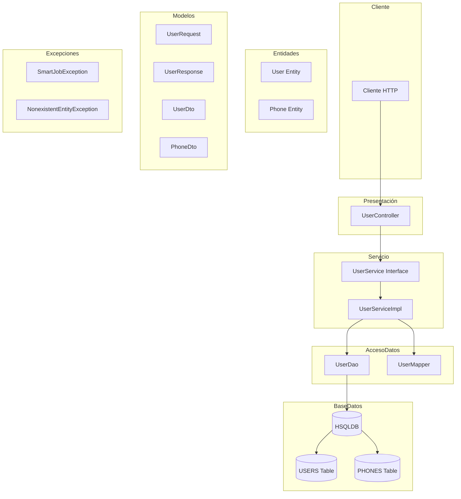
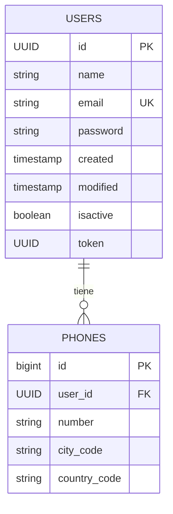
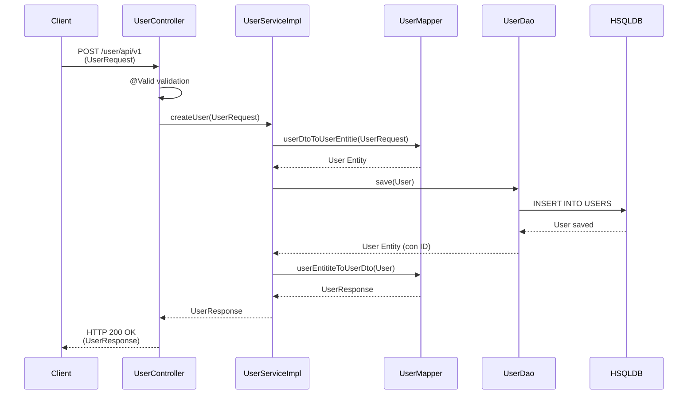
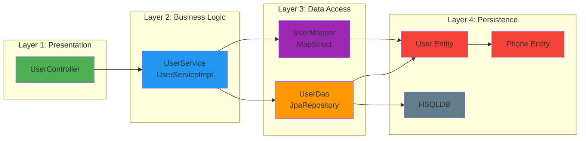

# Diagrama de Arquitectura - SmartJob Application

## Diagrama de Componentes y Flujo de Datos

## Diagrama de Entidades y Relaciones

## Diagrama de Flujo de Proceso - Crear Usuario

## Arquitectura en Capas

## Stack Tecnológico

- **Framework**: Spring Boot 3.5.7
- **Java**: 17
- **Base de Datos**: HSQLDB (In-Memory)
- **ORM**: Spring Data JPA / Hibernate
- **Mapping**: MapStruct 1.5.3
- **Validación**: Jakarta Validation
- **Build Tool**: Gradle
- **Lombok**: 0.11.0

## Descripción de Componentes

### Controller Layer
- **UserController**: Maneja las peticiones HTTP REST, valida los datos de entrada y devuelve respuestas JSON.

### Service Layer
- **UserService**: Interfaz que define el contrato del servicio.
- **UserServiceImpl**: Implementación de la lógica de negocio para crear usuarios.

### Data Access Layer
- **UserDao**: Repositorio JPA que extiende JpaRepository para operaciones CRUD.
- **UserMapper**: Interfaz MapStruct que mapea entre DTOs y entidades.

### Entity Layer
- **User**: Entidad JPA que representa la tabla USERS.
- **Phone**: Entidad JPA que representa la tabla PHONES con relación ManyToOne con User.

### Model/DTO Layer
- **UserRequest**: Modelo de entrada para crear usuarios.
- **UserResponse**: Modelo de salida con información del usuario creado.
- **UserDto**: DTO para transferencia de datos.
- **PhoneDto**: DTO para información de teléfonos.

### Exception Layer
- **SmartJobException**: Excepción personalizada base.
- **NonexistentEntityException**: Excepción para entidades no encontradas.

