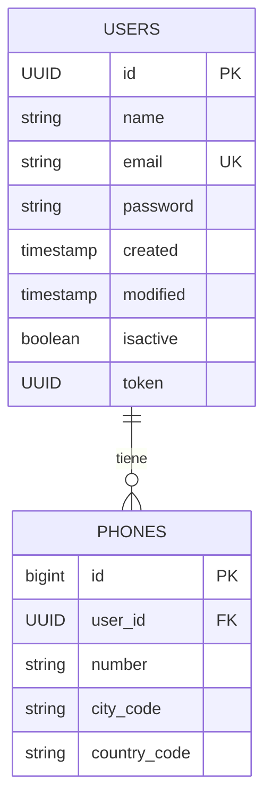
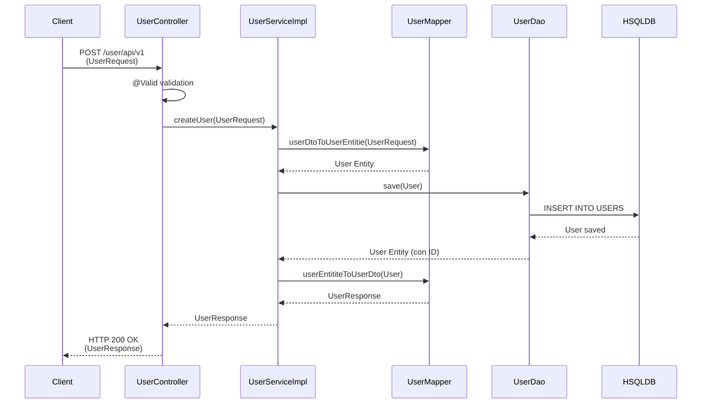
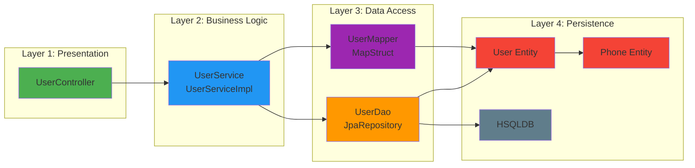

# Diagrama de Arquitectura - SmartJob Application

## Diagrama de Componentes y Flujo de Datos

```mermaid
graph TB
    subgraph "Cliente"
        CLIENT[Cliente HTTP]
    end

    subgraph "Capa de Presentacion"
        CONTROLLER[UserController<br/>@RestController]
    end

    subgraph "Capa de Servicio"
        SERVICE_IF[UserService<br/>Interface]
        SERVICE_IMPL[UserServiceImpl<br/>@Service]
    end

    subgraph "Capa de Acceso a Datos"
        DAO[UserDao<br/>JpaRepository]
        MAPPER[UserMapper<br/>@Mapper MapStruct]
    end

    subgraph "Capa de Entidades"
        USER_ENTITY[User Entity<br/>@Entity]
        PHONE_ENTITY[Phone Entity<br/>@Entity]
    end

    subgraph "Capa de Modelos/DTOs"
        USER_REQUEST[UserRequest]
        USER_RESPONSE[UserResponse]
        USER_DTO[UserDto]
        PHONE_DTO[PhoneDto]
    end

    subgraph "Capa de Excepciones"
        SMART_JOB_EX[SmartJobException]
        NONEXISTENT_EX[NonexistentEntityException]
    end

    subgraph "Base de Datos"
        DB[(HSQLDB<br/>In-Memory)]
        USERS_TABLE[(USERS Table)]
        PHONES_TABLE[(PHONES Table)]
    end

    CLIENT -->|POST /user/api/v1| CONTROLLER
    CONTROLLER -->|createUser| SERVICE_IF
    SERVICE_IF --> SERVICE_IMPL
    SERVICE_IMPL -->|userDtoToUserEntitie| MAPPER
    SERVICE_IMPL -->|save| DAO
    MAPPER -->|convierte| USER_REQUEST
    MAPPER -->|convierte| USER_ENTITY
    MAPPER -->|convierte| USER_RESPONSE
    MAPPER -->|convierte| USER_DTO
    DAO -->|persiste| USER_ENTITY
    USER_ENTITY -->|@ManyToOne| PHONE_ENTITY
    DAO -->|JPA| DB
    DB --> USERS_TABLE
    DB --> PHONES_TABLE
    CONTROLLER -.->|throws| SMART_JOB_EX
    SERVICE_IMPL -.->|throws| NONEXISTENT_EX
    USER_REQUEST --> PHONE_DTO

    style CONTROLLER fill:#e1f5ff
    style SERVICE_IMPL fill:#fff4e1
    style DAO fill:#e8f5e9
    style MAPPER fill:#f3e5f5
    style USER_ENTITY fill:#fff9c4
    style PHONE_ENTITY fill:#fff9c4
    style DB fill:#ffebee
```

## Diagrama de Entidades y Relaciones



## Diagrama de Flujo de Proceso - Crear Usuario



## Arquitectura en Capas



## Stack Tecnológico

- **Framework**: Spring Boot 3.5.7
- **Java**: 17
- **Base de Datos**: HSQLDB (In-Memory)
- **ORM**: Spring Data JPA / Hibernate
- **Mapping**: MapStruct 1.5.3
- **Validación**: Jakarta Validation
- **Build Tool**: Gradle
- **Lombok**: 0.11.0

## Descripción de Componentes

### Controller Layer
- **UserController**: Maneja las peticiones HTTP REST, valida los datos de entrada y devuelve respuestas JSON.

### Service Layer
- **UserService**: Interfaz que define el contrato del servicio.
- **UserServiceImpl**: Implementación de la lógica de negocio para crear usuarios.

### Data Access Layer
- **UserDao**: Repositorio JPA que extiende JpaRepository para operaciones CRUD.
- **UserMapper**: Interfaz MapStruct que mapea entre DTOs y entidades.

### Entity Layer
- **User**: Entidad JPA que representa la tabla USERS.
- **Phone**: Entidad JPA que representa la tabla PHONES con relación ManyToOne con User.

### Model/DTO Layer
- **UserRequest**: Modelo de entrada para crear usuarios.
- **UserResponse**: Modelo de salida con información del usuario creado.
- **UserDto**: DTO para transferencia de datos.
- **PhoneDto**: DTO para información de teléfonos.

### Exception Layer
- **SmartJobException**: Excepción personalizada base.
- **NonexistentEntityException**: Excepción para entidades no encontradas.


